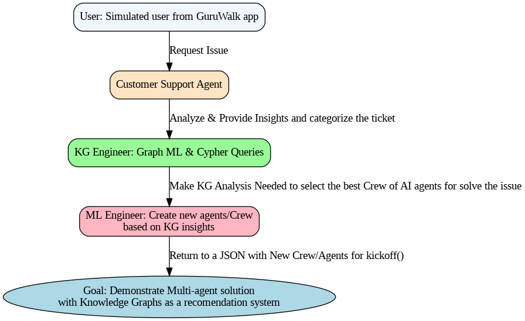
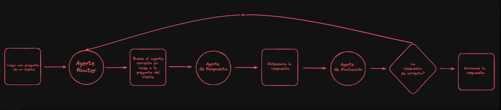
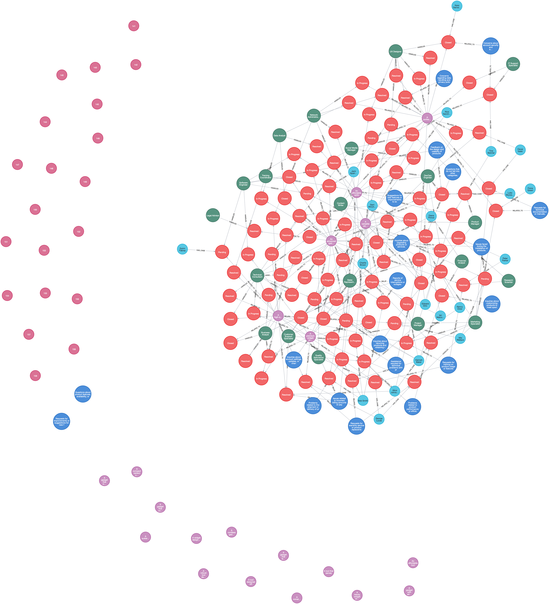
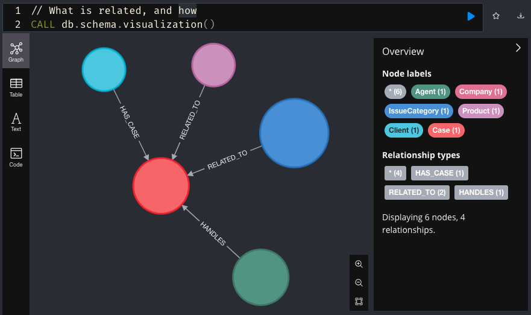
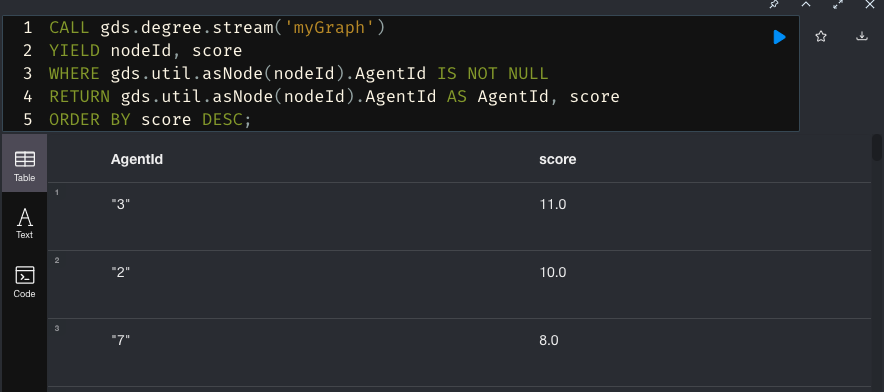
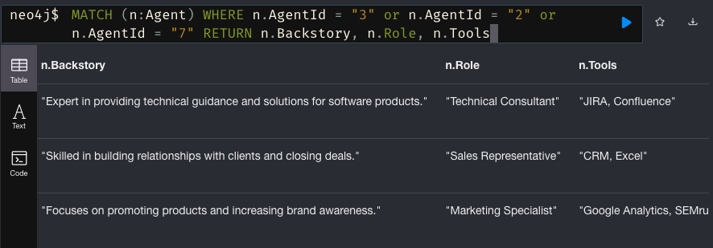
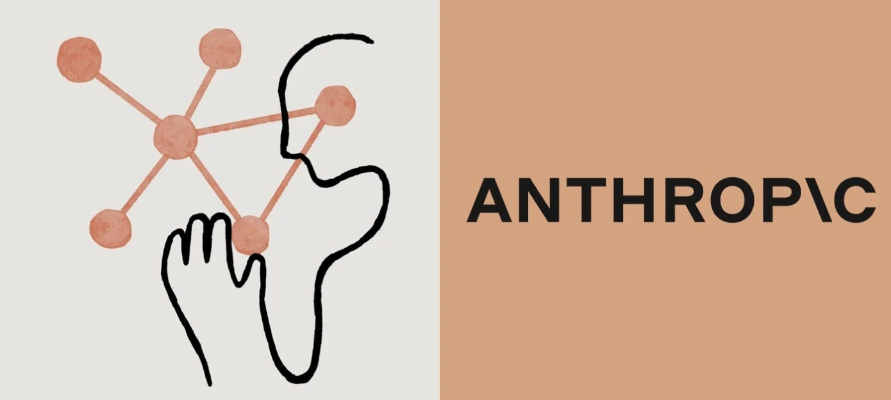

# llms-hackaton-2024

In this repo you will be able to simulate with a Crew of AI agents of a customer support agency, with the goal to solve custumers issues, in this case we are using this Crew of agents working in a Sequential flow:
    1 -  user: simulated user from GuruWalk app
    2 - customer_support_agent: specialized customer support agent
    3 - kg_engineer: Agent for execute Graph Machine Learning algorithms and create Cypher queries for obtain the best Agent for the issue, find find communities with similar cases.  
    4 - ml_engineer: Agent for instance new agents or Crew to be able to solve the issues based in the output of kg_engineer

We want to demostrate that if you use Knowledge Graphs with Multiagentic solutions be powered to get results baesed on rules transformed in knowledge.



### Goal

Perform the current process of the 'Router Agent', based in Knowledge and KG Machine learning algorithms, to allow auto feedback and delegations with more accuracy.




## Knowledge Graph Recommender System



### Overview
The **Knowledge Graph Recommender System** is a Python class designed to facilitate interaction with a Neo4j graph database. It provides methods for creating nodes, calculating centrality measures, and analyzing similarities and communities among nodes. Thi is particularly useful for applications that require graph-based data modeling and analysis.

#### Schema



### Requirements
- install Neo4j Desktop or self host Server that alows [GDS](https://neo4j.com/docs/graph-data-science/current/algorithms/)
- Establish a connection to a Neo4j database.
- Calculate degree centrality for nodes.
- Assess similarity between nodes.
- Detect communities among clients and agents using graph algorithms.
- Import data from Cypher Queries in folder scripts

### Installation
To use the Knowledge Graph Recommender System, ensure you have Python installed (version 3.6 or higher) and then install the required libraries and Neo4j version `5.24.0` also for local development its important to consider install [GDS](https://neo4j.com/docs/graph-data-science/current/algorithms/) module for the Knowledge Graph Data Science


### Prerequisites
- Neo4j database instance (local or remote).
- Python 3.10 or higher.
- Install the Neo4j driver:

```bash
pip install -r requirements.txt
```

### Custumer Support Crewai Simulation
Run the Crew simulation from Notebook in folder 'crew' or from Streamlit App

## Results
 
#### Degree Centrality



#### Detail of the best Agents recommendation



### Used Tools

##### Mistral & Athropic as LLM Model




##### Google colab for notebooks


##### CodeGPT for code generation


### Team

**Alejandro Giraldo**

[](https://www.linkedin.com/in/alejandrosin/)


**Daniel Ruiz**

[](https://www.linkedin.com/in/luisdanielruiz-in/)